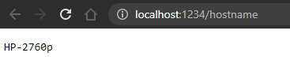

# Projekt 1

HTTP server, který na základě přijatého dotazu pošle odpověď na stranu klienta. Dotazy je možné provolat přes `curl`, `wget` anebo z webového prohlížeče. Server je napsaný v jazyce C++.

# Vytvoření spustitelného souboru

## Požadavky

Je potřeba mít nainstalovaný `g++`.

## Generování spustitelného souboru

Pomocí příkazu `make` vytvoříme spustitelný soubor `hinfosvc`.

# Spuštění serveru

Server spustíme pomocí následujícího příkazu:
```
$ ./hinfosvc [PORT]
```
`[PORT]` je povinný argument, který značí číslo portu, na kterém bude server naslouchat.

# Použití curl

Možné výstupy pro `curl`:

```
$ curl http://[SERVER_NAME]:[PORT]/hostname 
merlin.fit.vutbr.cz
```


```
$ curl http://[SERVER_NAME]:[PORT]/cpu-name 
Intel(R) Xeon(R) CPU E5-2640 0 @ 2.50GHz
```


```
$ curl http://[SERVER_NAME]:[PORT]/load 
65%
```
Při neplatném dotazu přijde `400 Bad Request`:
```
$ curl http://[SERVER_NAME]:[PORT]/lalapapa 
400 Not Found
```

# Použití wget

Možné výstupy pro `wget`:

```
$ wget -q -O - http://[SERVER_NAME]:[PORT]]/hostname /dev/null 
merlin.fit.vutbr.cz
```


```
$ wget -q -O - http://[SERVER_NAME]:[PORT]]/cpu-name /dev/null 
Intel(R) Xeon(R) CPU E5-2640 0 @ 2.50GHz
```


```
$ wget -q -O - http://[SERVER_NAME]:[PORT]]/load /dev/null 
65%
```
Parametr `-q` označuje tichý výstup.
Parametr `-O -` vypisuje výsledek na `stdout`.
Parametr `/dev/null` zahazuje všechny data.

Neplatný dotaz zde nevypíše nic.

# Použití ve Webovém prohlížeči

Ukázka volání ve webovém prohlížeči:




Při neplatném dotazu se vrátí `400 Bad Request`:


# Informace o projektu

* Autor: Tomáš Szabó
* Xlogin: xszabo16
* E-mail: xszabo16@stud.fit.vutbr.cz